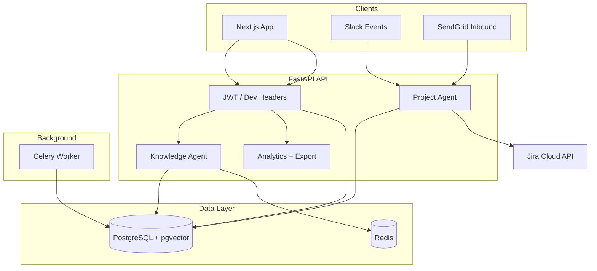

# AI Executive OS & SOP Automator

Monorepo for the AI-Powered Executive Operating System — RAG knowledge agent, Slack/email project routing, Jira sync, and production analytics.

## Structure

| Path | Description |
|------|-------------|
| `frontend/` | Next.js 16, Supabase Auth, Redux + hooks, Recharts analytics, Sentry |
| `backend/` | FastAPI, LangGraph agents, Celery, pgvector, Redis cache, rate limits |
| `docker/` | Docker Compose (dev + production) |
| [`docs/`](docs/README.md) | **Canonical docs** — §9 env vars, §10 Cursor rules, security audit |
| [`cursor.md`](cursor.md) | Cursor AI context (repo root — required by Cursor) |
| [`docs/PROJECT_MASTER.md`](docs/PROJECT_MASTER.md) | Product vision, sprints, RAG deep dive |

## Architecture



## Quick start (under 30 minutes)

### 1. Prerequisites

- Docker & Docker Compose
- OpenAI API key (required for RAG)
- Optional: Supabase project for auth

### 2. Configure environment

```bash
cp docker/.env.example docker/.env
# Edit: OPENAI_API_KEY, ENCRYPTION_KEY, DEFAULT_ORG_ID (your org UUID)
```

### 3. Run stack (development)

```bash
cd docker
docker compose up --build
```

| Service | URL |
|---------|-----|
| Frontend | http://localhost:3000 |
| API | http://localhost:8000 |
| OpenAPI | http://localhost:8000/docs |
| Health | http://localhost:8000/api/v1/health/ready |

### 4. Local dev (without Docker)

**Backend**

```bash
cd backend
python -m venv .venv && source .venv/bin/activate
pip install -r requirements.txt
alembic upgrade head
uvicorn app.main:app --reload
celery -A app.tasks.celery_app.celery_app worker --loglevel=info
```

**Frontend**

```bash
cd frontend
cp .env.example .env.local   # if present
npm install
npm run dev
```

## Production deploy

```bash
cp docker/.env.example docker/.env
# Set POSTGRES_PASSWORD, OPENAI_API_KEY, ENCRYPTION_KEY (required)

cd docker
docker compose -f docker-compose.prod.yml up --build -d
```

Uses multi-stage `backend/Dockerfile.prod`, startup env validation (`APP_ENV=production`), and `/api/v1/health/ready` checks.

## Environment variables

See **[docs/ENVIRONMENT_VARIABLES.md](docs/ENVIRONMENT_VARIABLES.md)** for §9 (master PDF table + how this repo implements it).  
See **[docs/CURSOR_RULES.md](docs/CURSOR_RULES.md)** / **[cursor.md](cursor.md)** for §10.

Quick start:

```bash
cp docker/.env.example docker/.env
# Set OPENAI_API_KEY, ENCRYPTION_KEY, NEXT_PUBLIC_SUPABASE_* at minimum
```

**Auth:** This project uses **Supabase Auth**, not NextAuth (`NEXTAUTH_*` vars do not apply).

**Jira / SendGrid:** Configure in the admin **Settings** UI (encrypted in DB), not via `JIRA_API_TOKEN` env vars.

## Authentication

**Production:** `Authorization: Bearer <supabase_jwt>` with `user_metadata.org_id` and `user_metadata.role`.

**Local dev (no JWT secret):** headers `X-Org-Id`, `X-User-Id`, `X-User-Role` (`admin` | `employee`).

## API reference

### Knowledge

| Method | Path | Auth | Description |
|--------|------|------|-------------|
| `POST` | `/api/v1/query` | User | RAG answer + citations (cached when repeat query) |
| `POST` | `/api/v1/query/stream` | User | SSE streaming |
| `POST` | `/api/v1/query/{id}/rating` | User | Human accuracy rating 1–5 |

Rate limit: **60 queries/minute** per user.

### Documents

| Method | Path | Auth | Description |
|--------|------|------|-------------|
| `POST` | `/api/v1/ingest` | Admin | Upload PDF/DOCX/MD → 202 |
| `GET` | `/api/v1/documents` | User | List documents |
| `DELETE` | `/api/v1/documents/{id}` | Admin | Cascade delete |

Rate limit: **10 uploads/hour** per org.

### Analytics & export (Sprint 5)

| Method | Path | Auth | Description |
|--------|------|------|-------------|
| `GET` | `/api/v1/analytics/dashboard` | Admin | Summary metrics |
| `GET` | `/api/v1/analytics/advanced` | Admin | 30-day charts, histograms, accuracy |
| `GET` | `/api/v1/export/queries.csv` | Admin | Compliance CSV |
| `GET` | `/api/v1/export/tickets.csv` | Admin | Compliance CSV |

### Project agent

| Method | Path | Description |
|--------|------|-------------|
| `POST` | `/api/v1/webhook/slack` | Slack Events API |
| `POST` | `/api/v1/webhook/email` | SendGrid inbound |
| `GET` | `/api/v1/tickets` | Ticket feed |
| `GET` | `/api/v1/tickets/{id}` | Detail + audit timeline |
| `GET/PUT` | `/api/v1/settings/integrations` | Encrypted Jira/SendGrid config |

### Health

| Method | Path | Description |
|--------|------|-------------|
| `GET` | `/api/v1/health` | Liveness |
| `GET` | `/api/v1/health/ready` | DB + Redis readiness |

## Feature flags

| Flag | Default |
|------|---------|
| `KNOWLEDGE_AGENT_ENABLED` | true |
| `ANALYTICS_DASHBOARD_ENABLED` | true |
| `PROJECT_AGENT_ENABLED` | true |
| `JIRA_INTEGRATION_ENABLED` | true |
| `EMAIL_WEBHOOK_ENABLED` | true |
| `WORKLOAD_BALANCING_ENABLED` | true |
| `AUDIT_LOG_ENABLED` | true |
| `CUSTOM_LLM_PROVIDER_ENABLED` | true |
| `FEATURE_RAG_CACHE_ENABLED` | true |

Backend prefix: `FEATURE_` (e.g. `FEATURE_RAG_CACHE_ENABLED`).

## RAG pipeline

### Document ingestion (§8.1)

1. **Upload** — Admin uploads PDF/DOCX/MD via Knowledge UI → `POST /api/v1/ingest` → file stored (Supabase Storage if configured, else `UPLOAD_DIR`) → DB `pending`
2. **Queue** — Celery `process_document` task
3. **Extract** — PyMuPDF / python-docx / plain text with page metadata
4. **Chunk** — LangChain `RecursiveCharacterTextSplitter` (≤800 tokens)
5. **Embed** — OpenAI `text-embedding-3-small` in batches of 100
6. **Store** — pgvector `document_chunks` via SQLAlchemy + asyncpg
7. **Ready** — `documents.status = ready` (visible in document library)

Optional Supabase Storage env: `SUPABASE_URL`, `SUPABASE_SERVICE_ROLE_KEY`, `SUPABASE_STORAGE_BUCKET` (default `documents`).

### Query path (§8.2)

1. Optional Redis cache hit (`SHA-256(query + org_id)`, 1h TTL)
2. Embed query (`text-embedding-3-small`)
3. pgvector cosine similarity — top 10 chunks (org-scoped)
4. Cohere rerank — top 5
5. `gpt-4o-mini` grade — keep score ≥ 3
6. `gpt-4o` generate answer with `[1]`, `[2]` citation markers
7. Format structured `{answer, citations}`
8. Stream via SSE (`/query/stream`) or JSON (`/query`)
9. Log to `queries` table for analytics

## Observability

- **Sentry:** set `SENTRY_DSN` (API) and `NEXT_PUBLIC_SENTRY_DSN` (browser)
- **Tracing:** JSON structured logs on each RAG span (`sop_automator.trace` logger)
- **Alerts:** configure Sentry alert rules for error rate > 1%

## Tests

```bash
cd backend && pytest          # 48 tests — cache, rate limit, load, regression
cd frontend && npm test       # Jest
cd frontend && npm run test:e2e # Playwright
```

## CI

GitHub Actions (`.github/workflows/ci.yml`): backend pytest + frontend lint/test on every PR.

## Security

See [docs/SECURITY_AUDIT.md](docs/SECURITY_AUDIT.md) for the Sprint 5 checklist. Run OWASP ZAP baseline against staging before client demos.
